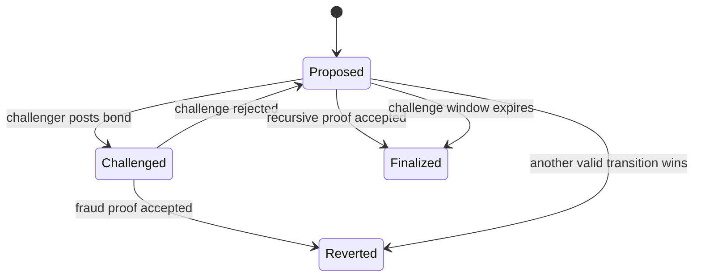

# V4 production research architecture

V4 is a proof-only production research path. It is separate from the trusted
V2/V3 demonstration contracts and never deploys trusted registration,
per-voter direct voting, trusted batches, mock verifiers, or the dealer
ceremony.

## Implemented foundation

| Requirement | V4 enforcement |
|---|---|
| Immutable election | `ElectionConfigV4` binds the national election, constituency, eligibility-root version, 4/16-candidate profile, keyset, DKG transcript, verifier versions, and windows at deployment |
| Versioned proofs | `VerifierRegistryV4` is append-only; active elections keep exact immutable versions |
| Separated governance | Registry administration and verifier management must be different addresses; production parameters are expected to be a timelock and multisig |
| Permissionless batches | Any funded batcher may propose a batch by posting the configured ERC-20 bond |
| Availability binding | Every proposal binds a package root and availability-certificate hash |
| Nullifier continuity | A proposal and finalization must start at the latest finalized nullifier root |
| Fraud window | Registered fraud verifiers decide typed challenges; successful challenges slash the batcher and failed challenges pay the batcher |
| Recursive path | A registered recursive verifier can finalize a batch immediately from a constant public-input hash |
| Interim path | Unchallenged batches may finalize optimistically after the challenge deadline; this remains an economic, not trustless, guarantee |
| Proof-gated tally | Anyone can publish once, but only when the candidate counts sum to the accepted ballot count and the registered tally verifier accepts the reconstructed inputs |
| Versioned artifacts | V4 vote, batch, DKG, share, proof, and tally types carry canonical digests and parent-artifact hashes |

`ignition/modules/ProductionV4.ts` has no mock or zero defaults. It references a
preconfigured verifier registry and deploys only:

1. `ElectionConfigV4`
2. `BatchCommitmentV4`
3. `TallyVerifierV4`

## Security states

Only `Finalized` batches contribute to `acceptedBallotCount` and the finalized
batch accumulator used by the tally proof.

## What is not yet a production claim

- The current registered verifier seam is tested with mocks, but real recursive,
  fraud, and tally verifier implementations still require their dedicated
  milestones and audits.
- The existing Anon Aadhaar adapter proves the integration approach, but the V4
  credential circuit must additionally bind constituency membership and the
  national-election nullifier domain.
- The existing 5-of-9 threshold demonstration is dealer-generated. It does not
  become V4-ready until the signed Pedersen DKG transcript and independent
  trustee services are implemented and reviewed.
- The availability certificate is cryptographically bound, but quorum storage
  retrieval and signer policy still belong to the distributed-storage
  milestone.
- Optimistic finalization is not trustless batching. That claim is permitted
  only after recursive verification is live and independently audited.

V4 remains a production-grade **research prototype**, not a legally certified
national election system.
